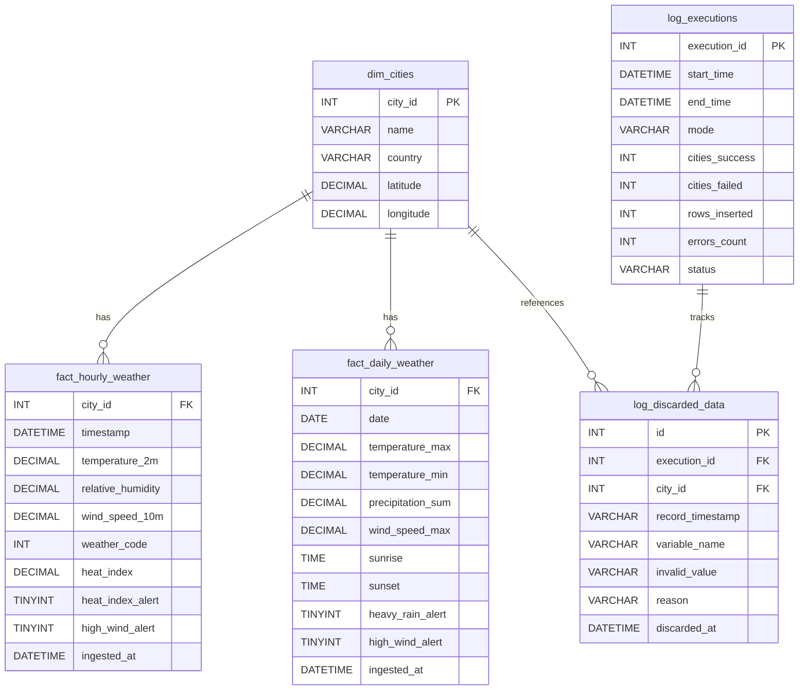

# ClimaData Solutions — ETL Pipeline

Automated ETL pipeline that extracts meteorological data from the [Open-Meteo API](https://open-meteo.com/), transforms and validates it, and loads it into a MySQL database for the analytics team.

Built with Python, MySQL, and a modular architecture following data engineering best practices.

---

## Table of Contents

- [Quick Start](#quick-start)
- [Architecture](#architecture)
- [Database Schema](#database-schema)
- [Installation](#installation)
- [Usage](#usage)
- [Configuration](#configuration)
- [Testing](#testing)
- [Scheduler](#scheduler)
- [Technical Decisions](#technical-decisions)
- [Project Structure](#project-structure)

---

## Quick Start

```bash
# 1. Install dependencies
pip install -r requirements.txt

# 2. Configure MySQL credentials
cp .env.example .env
# Edit .env with your credentials

# 3. Initialize the database (creates DB + tables + seeds 10 cities)
mysql -u root -p < sql/init_db.sql

# 4. Run the full pipeline
python main.py --mode all
```

---

## Architecture

```
Apache Airflow ──► Extract ──► Transform ──► Load ──► MySQL
 (DAG)              │            │             │
                    ▼            ▼             ▼
               Rate Limit   Data Quality   UPSERT
               Retry 3x     Heat Index     Partitioned
               Logging      Alerts         Idempotent
```

### Data Flow

1. **Extract**: Fetches weather data from Open-Meteo Forecast API (7-day hourly + daily) and Historical Archive API (last 90 days daily) for 10 cities across Central America and the Caribbean.
2. **Transform**: Normalizes timestamps, validates ranges, calculates Heat Index (Rothfusz regression), sets alert flags, and tracks discarded records.
3. **Load**: Inserts validated data into MySQL using `INSERT ... ON DUPLICATE KEY UPDATE` in batches of 100, ensuring idempotent execution.

### Target Cities

| City | Country | Latitude | Longitude |
|---|---|---|---|
| San Salvador | El Salvador | 13.6929 | -89.2182 |
| Santa Ana | El Salvador | 14.6349 | -89.5591 |
| Guatemala City | Guatemala | 14.6349 | -90.5069 |
| Tegucigalpa | Honduras | 14.0723 | -87.1921 |
| Managua | Nicaragua | 12.1150 | -86.2362 |
| San Jose | Costa Rica | 9.9281 | -84.0907 |
| Panama City | Panama | 8.9824 | -79.5199 |
| Santo Domingo | Dominican Republic | 18.4861 | -69.9312 |
| Kingston | Jamaica | 18.0179 | -76.8099 |
| San Juan | Puerto Rico | 18.4655 | -66.1057 |

### Weather Variables

**Hourly (Forecast):**
- Temperature at 2m (°C)
- Relative humidity (%)
- Wind speed at 10m (km/h)
- WMO weather code

**Daily (Forecast + Historical):**
- Max/min temperature (°C)
- Total precipitation (mm)
- Max wind speed (km/h)
- Sunrise/sunset times

---

## Database Schema

### ER Diagram



### Design Decisions

| Decision | Rationale |
|---|---|
| **DECIMAL(5,2)** for temperatures | Exact decimal storage avoids floating-point rounding errors. Range -999.99 to 999.99 covers all meteorological values with 2-decimal precision. FLOAT would introduce silent precision loss. |
| **Composite primary keys** (city_id + timestamp/date) | Enables `INSERT ... ON DUPLICATE KEY UPDATE` idempotency. Running the pipeline twice on the same data updates existing records instead of duplicating them. |
| **Indexes on timestamp/date columns** | Used in `WHERE` and `JOIN` clauses for analytics queries. Indexes significantly speed up range scans on time-series data. |
| **TINYINT(1)** for alert booleans | MySQL convention for boolean values. More storage-efficient than VARCHAR or ENUM for true/false flags. |
| **TIME** for sunrise/sunset | Stores only the time component since the date is already part of the composite PK. Avoids redundant date storage. |
| **Partitioning** | `PARTITION BY RANGE (YEAR)` on fact tables for massive scalability. |
| **Separate log tables** | `log_executions` tracks pipeline runs with row counts and error counts. `log_discarded_data` records every rejected value with the rejection reason for data quality auditing. |

---

## Installation

### Prerequisites

- Python 3.9+
- MySQL 8.0+ or MariaDB 10.4+ (via Docker, XAMPP, or local install)

### Step-by-Step Setup

```bash
# 1. Clone the repository
git clone <repo-url>
cd etl_pipeline

# 2. Create and activate virtual environment (recommended)
python -m venv venv
source venv/bin/activate    # Linux/Mac
venv\Scripts\activate       # Windows

# 3. Install dependencies
pip install -r requirements.txt

# 4. Configure environment variables
cp .env.example .env
# Edit .env with your MySQL credentials:
#   MYSQL_HOST=localhost
#   MYSQL_PORT=3306
#   MYSQL_USER=root
#   MYSQL_PASSWORD=yourpassword
#   MYSQL_DATABASE=climadata

# 5. Initialize the database
mysql -u root -p < sql/init_db.sql
# This creates the database, all 5 tables, indexes, and seeds the 10 cities.
```

### MySQL via Docker

```bash
docker run -d --name climadata-mysql \
  -e MYSQL_ROOT_PASSWORD=yourpassword \
  -e MYSQL_DATABASE=climadata \
  -p 3306:3306 \
  mysql:8.0

# Wait a few seconds, then initialize
mysql -h 127.0.0.1 -u root -pyourpassword < sql/init_db.sql
```

### MySQL via XAMPP (Windows)

If you have XAMPP installed, start MySQL from the XAMPP Control Panel and run:

```bash
C:\xampp\mysql\bin\mysql.exe -u root < sql\init_db.sql
```

---

## Usage

```bash
# Full pipeline: forecast (7-day) + historical (90-day backfill)
python main.py --mode all

# Forecast only: 7-day hourly + daily data for all 10 cities
python main.py --mode forecast

# Historical only: last 90 days of daily data for all 10 cities
python main.py --mode historical

# Dry run: extract and transform data without loading into MySQL
python main.py --mode forecast --dry-run
```

### Execution Output

Each run generates:

| Output | Location |
|---|---|
| Console logs | Real-time progress with per-city status |
| Log file | `logs/pipeline_YYYYMMDD_HHMMSS.log` |
| Markdown report | `data/reports/report_YYYYMMDD_HHMMSS.md` |
| Temperature chart | `data/reports/temperature_chart_YYYYMMDD.png` |

### Example Output

```
PIPELINE COMPLETE
  Mode:            forecast
  Dry Run:         False
  Cities OK:       10
  Cities Failed:   0
  Rows Inserted:   1750
  Data Discarded:  0
  Duration:        0:00:10
```

---

## Configuration

All pipeline parameters are externalized in two files:

### `config/config.yaml`

Contains all non-sensitive configuration:

- **Cities**: 10 target cities with coordinates and country
- **API URLs**: Forecast and Historical Archive endpoints
- **API variables**: Hourly and daily weather variables to request
- **Rate limiting**: Pause between requests (0.15s → ~600 req/min)
- **Retry**: Max 3 attempts with exponential backoff (1s, 2s, 4s)
- **Pipeline**: Historical window (90 days), batch size (100 records)
- **Alert thresholds**: Heat index (27°C + 40% humidity), heavy rain (50mm), high wind (60 km/h)
- **Validation ranges**: Temperature [-10, 55]°C, humidity [0, 100]%, precipitation ≥ 0

### `.env`

MySQL credentials (never committed to version control):

```
MYSQL_HOST=localhost
MYSQL_PORT=3306
MYSQL_USER=root
MYSQL_PASSWORD=
MYSQL_DATABASE=climadata
```

---

## Testing

```bash
# Run all 34 tests
python -m pytest tests/ -v

# Run a specific test class
python -m pytest tests/test_transform.py::TestHeatIndex -v
```

### Test Coverage

| Category | Tests | Description |
|---|---|---|
| **Heat Index** | 10 | Rothfusz formula calculation, threshold conditions, edge cases, known reference values |
| **Timestamp Parsing** | 7 | ISO 8601 formats (`T12:00`, `T12:00:00`, date-only), whitespace, invalid inputs |
| **Data Validation** | 11 | Temperature range [-10, 55]°C, humidity [0, 100]%, non-negative precipitation, None handling |
| **Transform Integration** | 6 | Full hourly/daily transform pipeline, alert flag computation, discarded record tracking |
| **Total** | **34** | All passing |

---

## Orchestration (Apache Airflow)

The pipeline is fully orchestrated using **Apache Airflow**, defined in `dags/weather_etl_dag.py`.

```bash
# Start Airflow along with the database
docker-compose up -d airflow
```

- Access the Airflow UI at `http://localhost:8080`.
- The DAG is scheduled to run every 6 hours automatically.
- Provides built-in retries, task dependencies, and alerting.

---

## Data Quality & Validation

Enterprise-grade Data Quality is embedded throughout the pipeline:
- **Idempotency**: MySQL UPSERT guarantees no duplicate records on reruns.
- **Physical Validations**: Temperature bounded [-10, 55]°C, non-negative precipitation.
- **Anomaly Tracking**: Bad records aren't just skipped; they are written to `log_discarded_data` for Data Engineers to audit.
- **Great Expectations Ready**: Included in dependencies for advanced suite validations.

---

## Technical Decisions

### Extraction

| Aspect | Implementation | Rationale |
|---|---|---|
| **Rate Limiting** | 0.15s pause between requests | Respects the free-tier limit of ~600 requests/minute |
| **Retry Strategy** | Exponential backoff: 1s → 2s → 4s, max 3 attempts | Handles transient server errors (5xx) and timeouts without hammering the API |
| **Error Classification** | 4xx = not retryable, 5xx/timeout = retryable | Client errors indicate a permanent problem; server errors are usually temporary |
| **Per-request Logging** | City, endpoint, status code, response time | Full traceability for debugging and monitoring API reliability |

### Transformation

| Aspect | Implementation | Rationale |
|---|---|---|
| **Heat Index** | Rothfusz regression equation with low/high humidity adjustments | Same formula used by U.S. National Weather Service. Verified against [calculator.net](https://www.calculator.net/heat-index-calculator.html) |
| **Heat Index Threshold** | Only calculated when T ≥ 26.7°C (80°F) and RH ≥ 40% | Below these conditions the formula produces unreliable results |
| **Timestamp Normalization** | Handles `YYYY-MM-DDTHH:MM`, `YYYY-MM-DDTHH:MM:SS`, and `YYYY-MM-DD` | The API returns different formats across endpoints |
| **Validation** | Discard and log values outside physical ranges | Temperature outside [-10, 55]°C, humidity outside [0, 100]%, negative precipitation |
| **Discarded Record Tracking** | Every rejected value is logged with variable name, value, and rejection reason | Enables data quality auditing and sensor error detection |

### Loading

| Aspect | Implementation | Rationale |
|---|---|---|
| **UPSERT** | `INSERT ... ON DUPLICATE KEY UPDATE` | Idempotent: running the pipeline twice on the same data updates records instead of duplicating them |
| **Batch Processing** | `executemany()` with chunks of 100 | Orders of magnitude faster than row-by-row inserts |
| **Parameterized SQL** | `%s` placeholders, never string concatenation | Prevents SQL injection vulnerabilities |
| **Per-city Error Handling** | `try/except` around each city with counter | One city failing (API down, invalid data) doesn't stop the other 9 |
| **Transaction Safety** | Commit per batch, rollback on error | Prevents partial batch inserts from corrupting the database |

### Code Quality

| Aspect | Implementation |
|---|---|
| **Modular Architecture** | Separate files for Extract, Transform, Load, Models, and Utilities |
| **Type Hints** | All functions annotated with parameter and return types |
| **Naming Convention** | English throughout, consistent snake_case |
| **Logging** | Python `logging` module with dual output (console + file), no `print()` |
| **Exception Handling** | All exceptions logged with traceback, never silently caught |
| **Configuration** | All parameters externalized in YAML config and .env file |

---

## Project Structure

```
etl_pipeline/
├── config/
│   └── config.yaml          # Cities, API settings, thresholds, validation
├── data/
│   └── reports/             # Auto-generated reports (.md) and charts (.png)
├── logs/                    # Execution log files
├── sql/
│   └── init_db.sql          # Database initialization (CREATE + seed data)
├── Makefile                 # Commands: make install, test, lint, run
├── dags/
│   └── weather_etl_dag.py   # Apache Airflow orchestration DAG
├── src/
│   ├── extract/
│   │   ├── __init__.py
│   │   └── api.py           # API extraction with retry and rate limiting
│   ├── transform/
│   │   ├── __init__.py
│   │   └── processor.py     # Validation, Heat Index, alert computation
│   ├── load/
│   │   ├── __init__.py
│   │   └── mysql.py         # MySQL UPSERT in batches, execution logging
│   ├── models/
│   │   ├── __init__.py
│   │   └── data_models.py   # Dataclasses with full type hints
│   └── utils/
│       ├── __init__.py
│       └── helpers.py       # Logging setup, config loader, reporting
├── tests/
│   ├── __init__.py
│   └── test_transform.py    # 52 unit tests (pytest)
├── main.py                  # CLI entry point (argparse)
├── scheduler.py             # Automatic forecast execution every 6 hours
├── requirements.txt         # Pinned dependencies
├── .env.example             # Environment template (safe to commit)
├── .gitignore               # Excludes .env, logs/, __pycache__/
└── README.md                # This file
```
